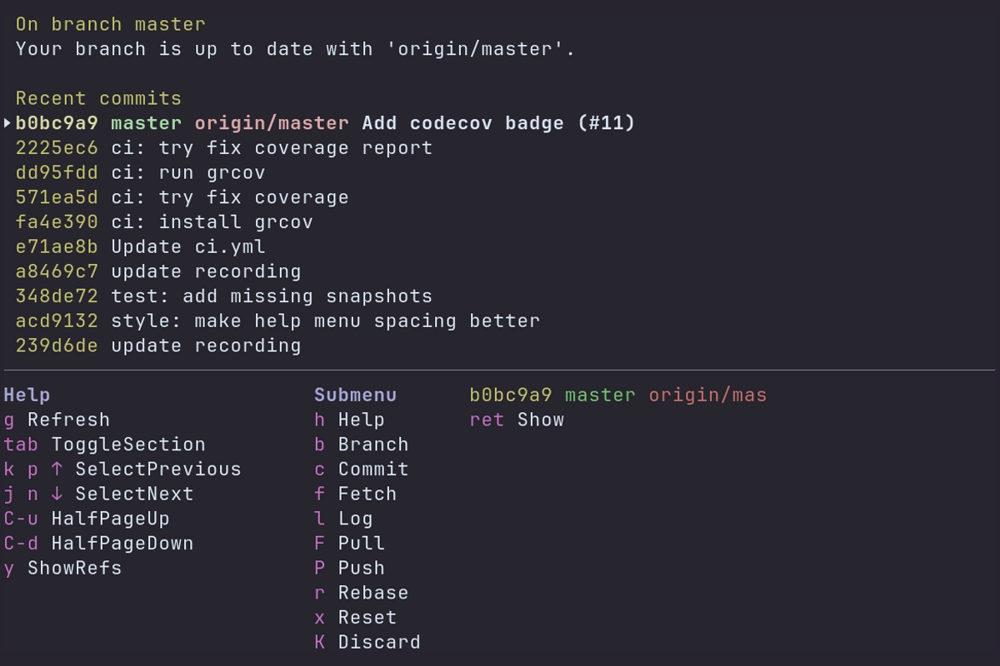

=======
## It's Gitu! - A Git porcelain *outside* of Emacs
[](https://github.com/gnostr-org/gnostr-git/actions/workflows/ci.yml)
[](https://github.com/gnostr-org/gnostr-git)

A terminal user interface for Git. Inspired by Magit, and launched straight from the terminal.


### Features
Gitu aims to implement many of the core features of Magit over time. 
It should be familiar to any previous Magit users.

A rough list of so-far supported features:
- File/Hunk/Line-level stage/unstage
- Show (view commits / open EDITOR at line)
- Show branches
- Branch:
  - checkout, checkout new
- Commit:
  - commit, amend, fixup
- Fetch:
  - all
- Log:
  - current
- Pull / Push:
  - remote
- Rebase:
  - abort, continue, autosquash, interactive
- Reset:
  - Soft, Mixed, Hard
- Stash:
  - save, pop, apply, drop

### Keybinds
A help-menu can be shown by pressing the `h` key.



### Install
#### Using Cargo
Run the command (recommended):
```
cargo install gitu --locked
```

...or to install from git, run:
```
cargo install --git https://github.com/altsem/gitu.git --locked
```

#### Arch Linux
You can install the `gitu` package from the [official extra repository](https://archlinux.org/packages/extra/x86_64/gitu/):

```
pacman -S gitu
```

#### Using Release binaries
gitu is available on Github Releases and should be installed from there.

The latest release is available
[here](https://github.com/altsem/gitu/releases).

Download the archive that is appropriate for your platform and extract the
binary into your `$PATH`. A common valid path location is `/usr/local/bin`.

#### Using Nix flakes
To build from `master` on flaked Nix platforms add this repo to your inputs:

```nix
inputs = {
  nixpkgs.url = "nixpkgs/nixos-unstable";
  gitu.url = "github:altsem/gitu";
};
```

Then wherever you install your packages (i.e., `home-manager`):

```nix
{ inputs, pkgs, ... }: {
  home.packages = [ inputs.gitu.packages.${pkgs.system}.default ];
}
```

You can also use this repo's binary cache to avoid building gitu:

```nix
nix.settings = {
  extra-substituters = [ "https://gitu.cachix.org" ];
  extra-trusted-public-keys =
    [ "gitu.cachix.org-1:iUIaNys1l3W1LF/M8OXzaTl7N/OinGOlzdUJUSc+5eY=" ];
}
```

### Configuration
The environment variables `GIT_EDITOR`, `VISUAL` or `EDITOR` (checked in this order) dictate which editor Gitu will open.

Configuration is also loaded from `~/.config/gitu/config.toml`,
you could copy the [default configuration](src/default_config.toml).


=========================================================

[](https://github.com/gnostr-org/gnostr-git/actions?query=branch%3Amaster+event%3Apush)

=========================================================


Git - fast, scalable, distributed revision control system
=========================================================

Git is a fast, scalable, distributed revision control system with an
unusually rich command set that provides both high-level operations
and full access to internals.

Git is an Open Source project covered by the GNU General Public
License version 2 (some parts of it are under different licenses,
compatible with the GPLv2). It was originally written by Linus
Torvalds with help of a group of hackers around the net.

Please read the file [INSTALL][] for installation instructions.

Many Git online resources are accessible from <https://git-scm.com/>
including full documentation and Git related tools.

See [Documentation/gittutorial.txt][] to get started, then see
[Documentation/giteveryday.txt][] for a useful minimum set of commands, and
`Documentation/git-<commandname>.txt` for documentation of each command.
If git has been correctly installed, then the tutorial can also be
read with `man gittutorial` or `git help tutorial`, and the
documentation of each command with `man git-<commandname>` or `git help
<commandname>`.

CVS users may also want to read [Documentation/gitcvs-migration.txt][]
(`man gitcvs-migration` or `git help cvs-migration` if git is
installed).

The user discussion and development of Git take place on the Git
mailing list -- everyone is welcome to post bug reports, feature
requests, comments and patches to git@vger.kernel.org (read
[Documentation/SubmittingPatches][] for instructions on patch submission
and [Documentation/CodingGuidelines][]).

Those wishing to help with error message, usage and informational message
string translations (localization l10) should see [po/README.md][]
(a `po` file is a Portable Object file that holds the translations).

To subscribe to the list, send an email with just "subscribe git" in
the body to majordomo@vger.kernel.org (not the Git list). The mailing
list archives are available at <https://lore.kernel.org/git/>,
<http://marc.info/?l=git> and other archival sites.

Issues which are security relevant should be disclosed privately to
the Git Security mailing list <git-security@googlegroups.com>.

The maintainer frequently sends the "What's cooking" reports that
list the current status of various development topics to the mailing
list.  The discussion following them give a good reference for
project status, development direction and remaining tasks.

The name "git" was given by Linus Torvalds when he wrote the very
first version. He described the tool as "the stupid content tracker"
and the name as (depending on your mood):

 - random three-letter combination that is pronounceable, and not
   actually used by any common UNIX command.  The fact that it is a
   mispronunciation of "get" may or may not be relevant.
 - stupid. contemptible and despicable. simple. Take your pick from the
   dictionary of slang.
 - "global information tracker": you're in a good mood, and it actually
   works for you. Angels sing, and a light suddenly fills the room.
 - "goddamn idiotic truckload of sh*t": when it breaks

[INSTALL]: INSTALL
[Documentation/gittutorial.txt]: Documentation/gittutorial.txt
[Documentation/giteveryday.txt]: Documentation/giteveryday.txt
[Documentation/gitcvs-migration.txt]: Documentation/gitcvs-migration.txt
[Documentation/SubmittingPatches]: Documentation/SubmittingPatches
[Documentation/CodingGuidelines]: Documentation/CodingGuidelines
[po/README.md]: po/README.md
